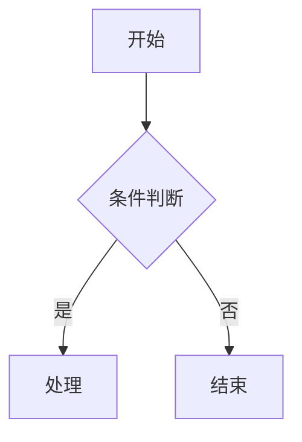
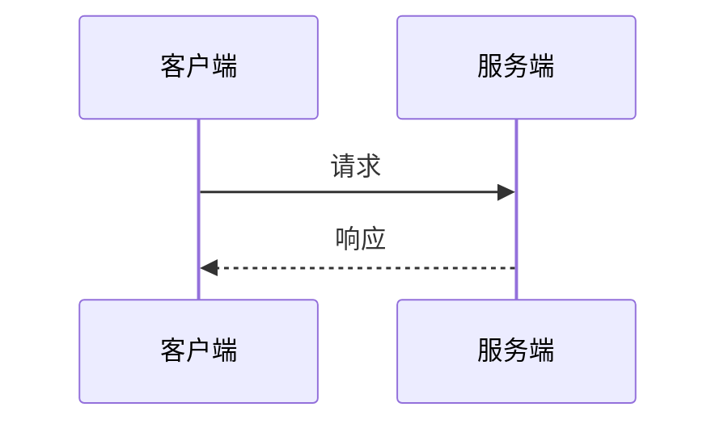
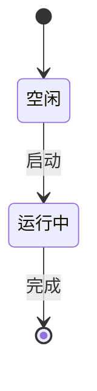
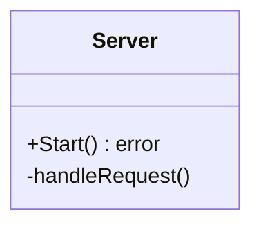

# AI Agent 工作约定

## 绘图规范

AI 在文档、注释或代码审查中需要绘制图表时，**必须使用 Markdown 可渲染的语法**（如 [Mermaid.js](https://mermaid.js.org/)），禁止使用 ASCII 艺术图或不可渲染的文本图形。

### 支持的图表类型及示例

#### 流程图（Flowchart）

#### 时序图（Sequence Diagram）

#### 状态图（State Diagram）

#### 类图（Class Diagram）

## 项目结构规范

本项目遵循 [Go 官方项目布局](https://go.dev/doc/modules/layout) 约定：

- `/cmd/` — 可执行程序入口，每个子目录对应一个 main package
- `/internal/` — 私有应用代码，不被外部导入
- `/pkg/` — 可对外暴露的库代码（本项目暂未使用）
- `/docs/` — 文档
- `/scripts/` — 辅助脚本
- `/config.example.yaml` — 配置文件模板
- `go.mod` — 模块声明为 `ai/gateway`

## Go 代码风格约定

1. **接口设计**：小而精准，定义在消费方，参考 `internal/proxy/interfaces.go`
2. **错误处理**：使用 `fmt.Errorf("context: %w", err)` 包装错误链
3. **日志**：使用结构化键值对 `logger.Error("msg", "key", value)`
4. **测试**：遵循 `_test.go` 命名，使用标准库 `testing` 包
5. **配置**：使用 `gopkg.in/yaml.v3` 反序列化，结构体标签 `yaml:"field_name"`
6. **导入分组**：标准库 → 第三方包 → 内部包，每组空行分隔
7. **无 init() 函数**：依赖显式初始化（`NewServer(cfg, ...)` 模式）
