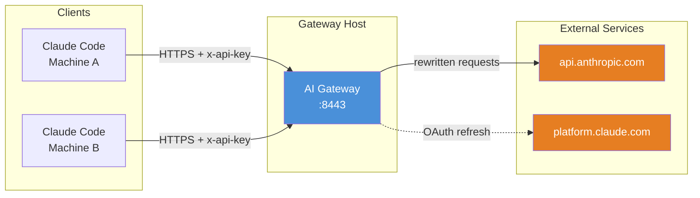

# AI Gateway — AI API Identity Gateway

> A zero-dependency AI API identity gateway. A reverse proxy that normalizes device fingerprints and telemetry data for privacy-preserving API proxying.

## Features

- **Unified Identity** — Multiple client machines share a single canonical device identity
- **Centralized OAuth** — Gateway manages OAuth token lifecycle; clients never touch platform.claude.com
- **Request Rewriting** — Automatically replaces device ID, environment fingerprints, process metrics, etc.
- **System Prompt Masking** — Rewrites Platform/Shell/OS/path information in `<env>` blocks
- **Billing Header Stripping** — Removes `x-anthropic-billing-header` for maximum cross-session cache sharing
- **Event Log Sanitization** — Strips `baseUrl`, `gateway` and other gateway-leaking fields
- **TLS Support** — Optional TLS encryption for production deployments
- **Audit Logging** — Records which client made each request

## Architecture Overview



See [Architecture Document](https://github.com/motiful/ai-gateway-go/blob/main/docs/架构.md) for detailed architecture.

## Quick Start

### Prerequisites

- Go 1.26+
- A valid Claude Code OAuth refresh_token

### Install

```bash
git clone <repo-url> ai-gateway-go
cd ai-gateway-go

# Build
go build -o gateway ./cmd/gateway
```

### Pre-Startup Preparation

Before starting the gateway, you need to prepare:

1. **OAuth Refresh Token** — Extract from macOS Keychain or existing Claude Code configuration
2. **Device Identity** — Run `./gateway gen-identity` to generate a canonical device ID
3. **Client Tokens** — Run `./gateway gen-token <machine-name>` for each client machine

See [Pre-Startup Preparation](https://github.com/motiful/ai-gateway-go/blob/main/docs/启动前准备.md) for detailed steps.

### Configuration

```bash
cp config.example.yaml config.yaml
# Edit config.yaml with your OAuth token, device identity, and client tokens
```

### Run

```bash
./gateway serve config.yaml
```

With custom config path:

```bash
./gateway serve /path/to/config.yaml
```

Docker:

```bash
docker build -t ai-gateway .
docker run -d -p 8443:8443 -v $(pwd)/config.yaml:/etc/ai-gateway/config.yaml ai-gateway
```

## Command Reference

| Command | Description |
|---------|-------------|
| `gateway serve [config-path]` | Start the proxy server (alias `start`) |
| `gateway gen-identity` | Generate a canonical device identity |
| `gateway gen-token [name]` | Generate a client authentication token |
| `gateway help [command]` | Show help for any command |
| `gateway completion [shell]` | Generate shell autocompletion scripts |

## Configuration Guide

The configuration file uses YAML format with the following sections:

### server

```yaml
server:
  port: 8443
  tls:
    cert: ./certs/cert.pem    # optional, omit for HTTP
    key: ./certs/key.pem
```

### upstream

```yaml
upstream:
  url: https://api.anthropic.com
```

### oauth

```yaml
oauth:
  access_token: ""                     # optional, leave empty to auto-refresh
  refresh_token: "your-refresh-token"  # required
  expires_at: 0                        # access_token expiry timestamp (ms)
```

### auth

```yaml
auth:
  tokens:
    - name: machine-a                  # client name (used in audit logs)
      token: "client-token-here"       # client's authentication token
```

### identity

```yaml
identity:
  device_id: "64-char-hex-string"      # generated via gen-identity
  email: "user@example.com"
```

### env

```yaml
env:
  platform: darwin
  arch: arm64
  version: "2.1.81"
  # ... other environment fields
```

### process

```yaml
process:
  constrained_memory: 34359738368                  # 32GB
  rss_range: [300000000, 500000000]                # RSS random range
  heap_total_range: [40000000, 80000000]
  heap_used_range: [100000000, 200000000]
```

### logging

```yaml
logging:
  level: info     # debug | info | warn | error
  audit: true     # enable audit logging
```

## Health Endpoints

### `GET /_health`

Returns gateway status, no authentication required.

```json
{
  "status": "ok",
  "oauth": "valid",
  "canonical_device": "canonical...",
  "upstream": "https://api.anthropic.com",
  "clients": ["machine-a", "machine-b"]
}
```

### `GET /_verify`

Shows the rewriting effect on a sample request, requires authentication.

```bash
curl -H "x-api-key: <client-token>" https://gateway:8443/_verify
```

## Testing

```bash
go test -v -count=1 ./...
```

## Build

```bash
# Build binary
go build -ldflags="-s -w" -o gateway ./cmd/gateway

# Docker image (< 15MB)
docker build -t ai-gateway:latest .
```

## Comparison with TypeScript Version

| Feature | TypeScript | Go |
|---------|-----------|-----|
| Runtime | Node.js 24+ | Go 1.26+ native binary |
| Startup | `npm start config.yaml` | `gateway serve config.yaml` |
| Docker Image | ~200MB | < 15MB |
| CLI | Manual argv parsing | Cobra (--help, subcommands) |
| Performance | V8 JIT dependent | Compiled native |
| Dependencies | 10+ external packages | Only Cobra + yaml.v3 |

## License

MIT
