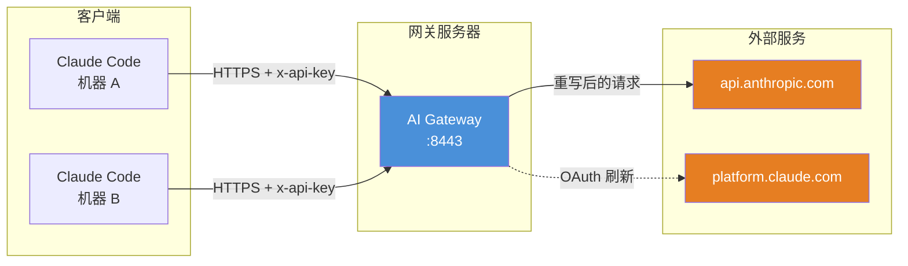

# AI Gateway — AI API 身份网关

> 零依赖的 AI API 身份网关。一个反向代理，用于规范化设备指纹和遥测数据，实现隐私保护的 API 代理。

## 功能特性

- **身份统一** — 多台客户端机器共享同一个规范化的设备身份
- **OAuth 集中管理** — 网关统一维护 OAuth Token 生命周期，客户端无需接触 platform.claude.com
- **请求重写** — 自动替换设备 ID、环境指纹、进程指标等敏感信息
- **系统提示词伪装** — 重写 `<env>` 块中的 Platform/Shell/OS/路径等环境信息
- **计费头剥离** — 移除 `x-anthropic-billing-header`，最大化跨会话缓存共享
- **事件日志清理** — 删除 `baseUrl`、`gateway` 等泄漏网关地址的字段
- **TLS 支持** — 可选启用 TLS 加密
- **审计日志** — 记录每个请求由哪个客户端发起

## 架构概览



详细架构说明请查看 [架构文档](架构.md)。

## 快速开始

### 前提条件

- Go 1.26+
- 一个有效的 Claude Code OAuth refresh_token

### 安装

```bash
git clone <仓库地址> ai-gateway-go
cd ai-gateway-go

# 编译
go build -o gateway ./cmd/gateway
```

### 启动前准备

在启动网关之前，需要准备以下配置：

1. **OAuth Refresh Token** — 从 macOS 钥匙串或现有 Claude Code 配置中提取
2. **设备身份** — 运行 `./gateway gen-identity` 生成规范化的设备 ID
3. **客户端令牌** — 为每台客户端机器运行 `./gateway gen-token <机器名>`

详细步骤请参考 [启动前准备文档](启动前准备.md)。

### 配置

```bash
cp config.example.yaml config.yaml
# 编辑 config.yaml，填入 OAuth Token、设备身份和客户端令牌
```

### 运行

```bash
./gateway serve config.yaml
```

带自定义配置路径：

```bash
./gateway serve /path/to/config.yaml
```

Docker 运行：

```bash
docker build -t ai-gateway .
docker run -d -p 8443:8443 -v $(pwd)/config.yaml:/etc/ai-gateway/config.yaml ai-gateway
```

## 命令参考

| 命令 | 说明 |
|------|------|
| `gateway serve [config-path]` | 启动代理服务器（别名 `start`） |
| `gateway gen-identity` | 生成规范化的设备 ID |
| `gateway gen-token [name]` | 生成客户端认证 Token |
| `gateway help [command]` | 查看命令帮助 |
| `gateway completion [shell]` | 生成 shell 自动补全脚本 |

## 配置说明

配置文件为 YAML 格式，主要包含以下部分：

### server — 服务端配置

```yaml
server:
  port: 8443
  tls:
    cert: ./certs/cert.pem    # 可选，留空则使用 HTTP
    key: ./certs/key.pem
```

### upstream — 上游 API

```yaml
upstream:
  url: https://api.anthropic.com
```

### oauth — OAuth 令牌

```yaml
oauth:
  access_token: ""                     # 可选，留空自动刷新
  refresh_token: "your-refresh-token"  # 必填
  expires_at: 0                        # access_token 过期时间戳（毫秒）
```

### auth — 客户端认证

```yaml
auth:
  tokens:
    - name: machine-a                  # 客户端名称（审计日志使用）
      token: "client-token-here"       # 客户端调用时使用的令牌
```

### identity — 规范化的设备身份

```yaml
identity:
  device_id: "64字符十六进制字符串"      # 通过 gen-identity 生成
  email: "user@example.com"
```

### process — 规范化的进程指标

```yaml
process:
  constrained_memory: 34359738368                  # 32GB
  rss_range: [300000000, 500000000]                # RSS 随机范围
  heap_total_range: [40000000, 80000000]
  heap_used_range: [100000000, 200000000]
```

### logging — 日志配置

```yaml
logging:
  level: info     # debug | info | warn | error
  audit: true     # 是否记录审计日志
```

## 健康检查

网关提供了两个管理端点：

### `GET /_health`

返回网关运行状态，无需认证。

```json
{
  "status": "ok",
  "oauth": "valid",
  "canonical_device": "canonical...",
  "upstream": "https://api.anthropic.com",
  "clients": ["machine-a", "machine-b"]
}
```

### `GET /_verify`

展示请求重写效果，需要客户端认证。

```bash
curl -H "x-api-key: <client-token>" https://gateway:8443/_verify
```

## 测试

```bash
go test -v -count=1 ./...
```

## 构建

```bash
# 构建二进制
go build -ldflags="-s -w" -o gateway ./cmd/gateway

# Docker 镜像（< 15MB）
docker build -t ai-gateway:latest .
```

## 与 TypeScript 版对比

| 功能 | TypeScript 版 | Go 版 |
|------|---------------|-------|
| 运行环境 | Node.js 24+ | Go 1.26+ 原生二进制 |
| 启动方式 | `npm start config.yaml` | `gateway serve config.yaml` |
| Docker 镜像 | ~200MB | < 15MB |
| CLI | 手动解析参数 | Cobra（--help、子命令） |
| 性能 | 依赖 V8 JIT | 编译型原生 |
| 依赖 | 10+ 外部包 | 仅 Cobra + yaml.v3 |

## 许可证

MIT
