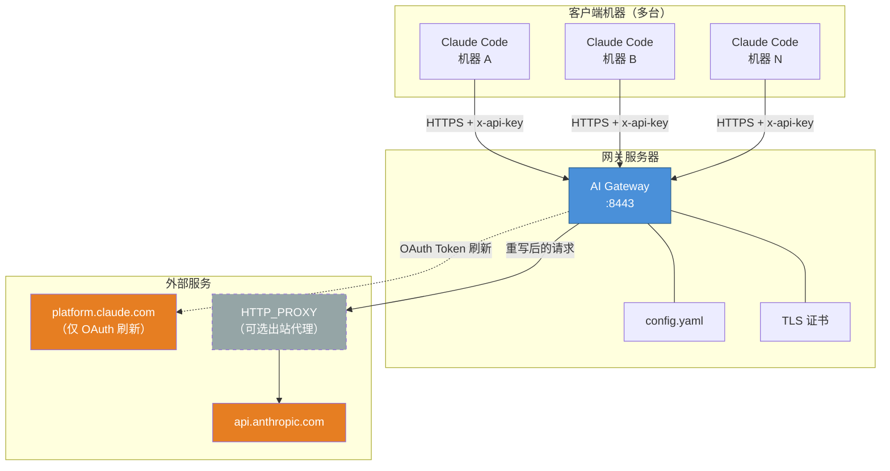
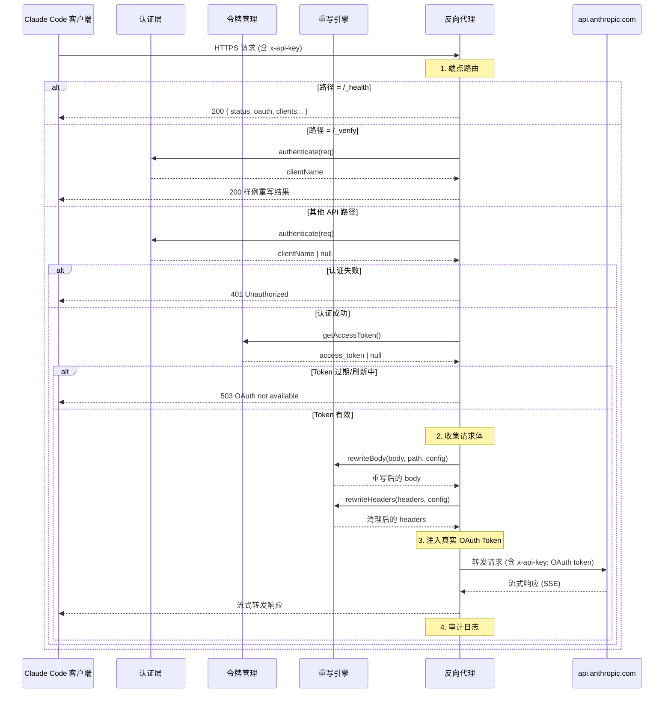
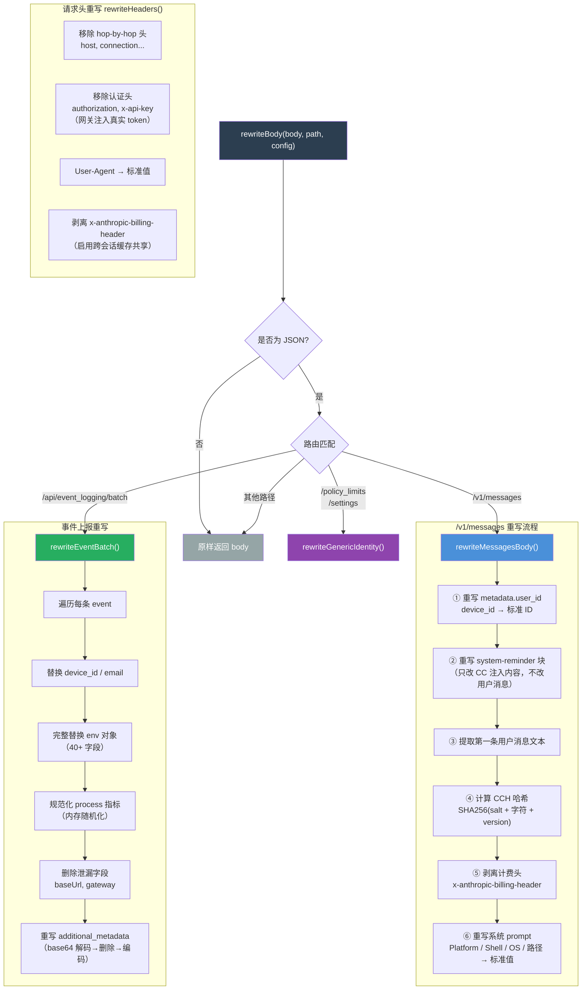
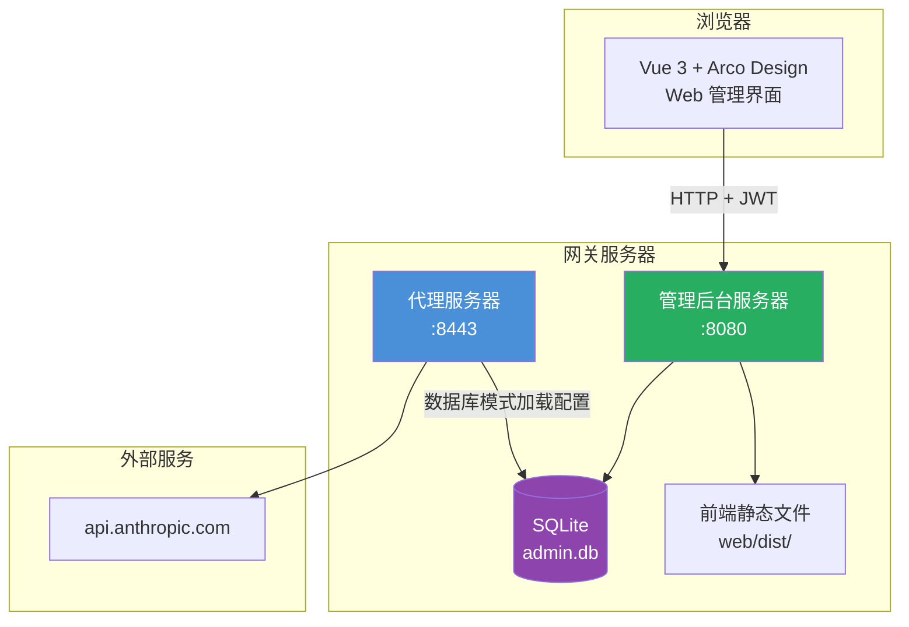

# AI Gateway 业务逻辑架构

## 一、系统部署拓扑



**关键约束**：
- 客户端 **绝不** 直连 Anthropic 或 platform.claude.com，必须通过网关
- 配套 Clash 规则（`clash-rules.yaml`）在客户端网络层阻截所有直连尝试

---

## 二、请求处理主流程（时序图）



---

## 三、重写引擎核心逻辑



---

## 四、OAuth 令牌生命周期

```mermaid
stateDiagram-v2
    [*] --> 检查缓存: initOAuth(config)

    检查缓存 --> 直接使用: Access Token 有效<br/>（过期 > 5min）
    检查缓存 --> 立即刷新: Token 缺失或已过期

    直接使用 --> 运行中: 缓存 Token
    立即刷新 --> 运行中: 调用 platform.claude.com

    state 运行中 {
        [*] --> 服务请求: getAccessToken() 被调用
        服务请求 --> 返回Token: 未过期
        服务请求 --> 返回null: 已过期（等待刷新）
        --
        定时刷新: setTimeout<br/>（过期前 5min）
        定时刷新 --> 刷新成功: POST /v1/oauth/token
        定时刷新 --> 重试: 刷新失败，30s 后重试
        刷新成功 --> 定时刷新: 重新调度
        重试 --> 定时刷新: 重新调度
    end

    note right of 直接使用
        零网络调用
        即时启动
    end note

    note right of 运行中
        网关集中管理
        客户端无需接触
        platform.claude.com
    end note
```

**OAuth 刷新的请求参数（逆向自 Claude Code 客户端）**：

```
POST https://platform.claude.com/v1/oauth/token
Body: {
  grant_type: "refresh_token",
  refresh_token: <token>,
  client_id: "9d1c250a-e61b-44d9-88ed-5944d1962f5e",
  scope: "user:inference user:profile user:sessions:claude_code ..."
}
```

---

## 五、Web 管理后台架构



管理后台与代理服务器是两个独立的进程：

| 进程 | 端口 | 作用 |
|------|------|------|
| `gateway admin` | 8080 | 提供 Web 管理界面 API（初始化、登录、配置管理） |
| `gateway serve` | 8443 | 反向代理服务（转发请求到 Anthropic） |

### 初始化流程

1. 用户访问 `http://localhost:8080`，前台通过 `GET /api/system/init-status` 检查初始化状态
2. 未初始化时重定向至 `/init` 页面，填写网关配置和管理员账户
3. 提交后后台事务性写入 SQLite：`SystemConfig` + `Admin` + `AppConfig`
4. 之后 `gateway serve --db ./data/admin.db` 从数据库加载完整配置启动代理服务

## 六、项目目录结构

```
.
├── cmd/
│   └── gateway/            # 二进制入口
│       └── main.go         # 仅调用 cli.Execute()
├── internal/
│   ├── admin/              # Web 管理后台（Chi 路由 + API）
│   ├── auth/               # 客户端认证（x-api-key / Bearer token）
│   ├── cli/                # Cobra 命令定义（serve / admin / gen-*）
│   ├── config/             # YAML 配置加载与验证、DB 配置转换
│   ├── database/           # SQLite 数据库（GORM 模型 + CRUD）
│   ├── logger/             # 结构化日志 + 审计日志
│   ├── model/              # 数据模型（FullConfig、Admin、SystemConfig）
│   ├── oauth/              # OAuth Token 生命周期管理
│   ├── proxy/              # 反向代理服务器
│   └── rewriter/           # 请求体/请求头重写引擎
├── web/                    # Vue 3 + Arco Design 管理后台前端
│   ├── src/
│   │   ├── views/          # Init / Login / Dashboard / ConfigManagement
│   │   ├── router/         # 路由守卫（初始化检查 + JWT 认证）
│   │   └── api/            # API 调用封装
│   └── vite.config.ts      # 开发代理配置
├── docs/                   # 项目文档
├── scripts/                # 辅助脚本
├── config.example.yaml     # 配置文件模板
├── Dockerfile              # Docker 构建
├── Makefile                # 构建/测试/运行命令
└── go.mod                  # 模块: ai/gateway
```

## 六、Go 版与 TypeScript 版差异

| 维度 | TypeScript 版 | Go 版（当前） |
|------|--------------|---------------|
| 运行时 | Node.js | 原生二进制 |
| 启动命令 | `npm start config.yaml` | `gateway serve config.yaml` / `gateway admin` |
| 包管理 | npm | Go modules |
| 构建产物 | JavaScript 源码运行 | 单文件二进制 |
| 镜像体积 | ~200MB | < 15MB |
| CLI 框架 | 无（手动解析 argv） | Cobra |
| Web 管理后台 | 无 | Vue 3 + Arco Design |
| 配置存储 | 仅 YAML 文件 | YAML 文件 + SQLite 数据库 |
| 测试框架 | Node assert | Go testing |
