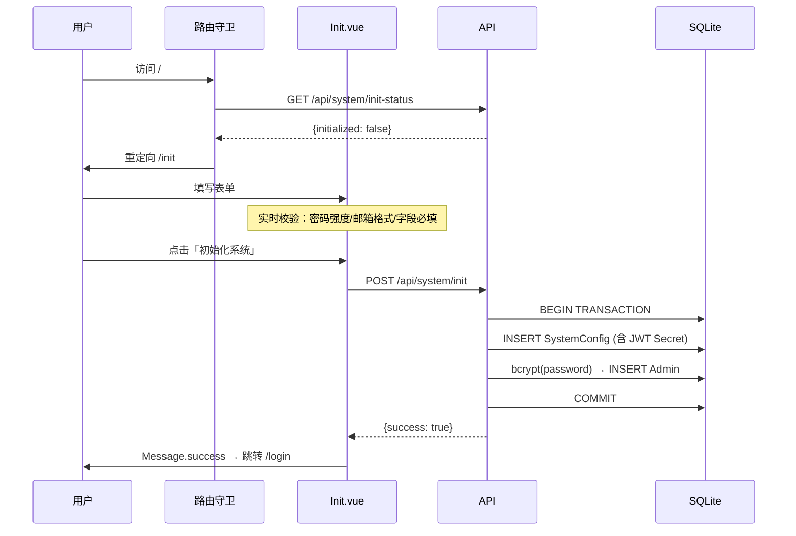
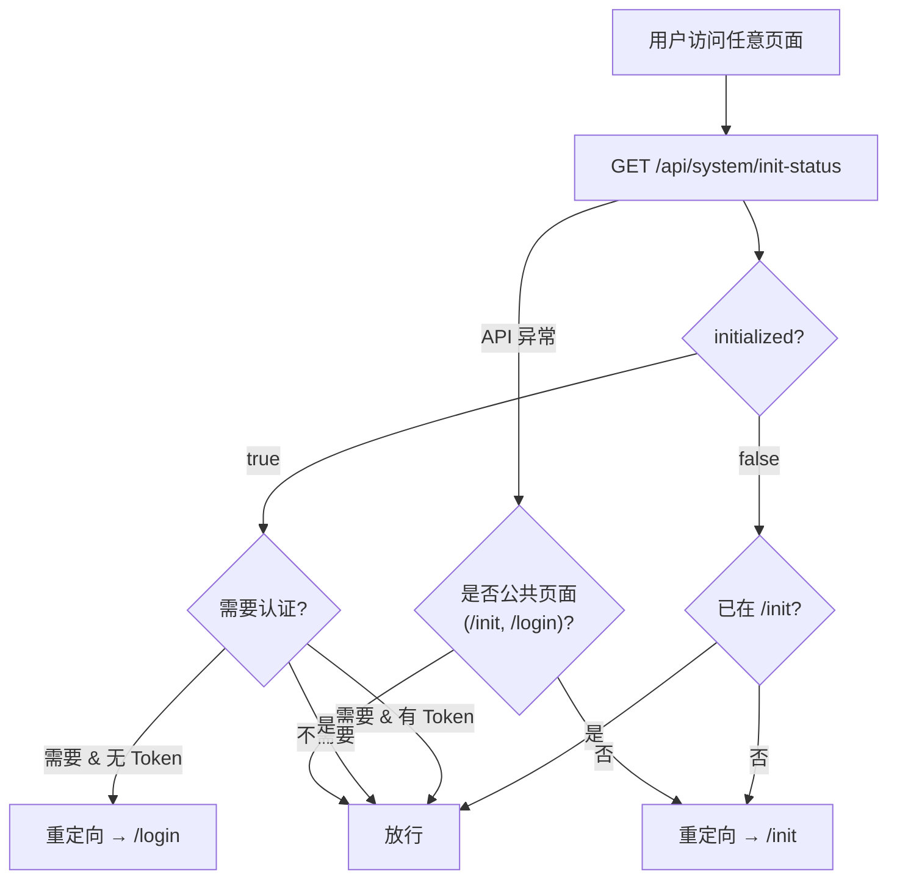

# Web 管理后台系统初始化流程

## 一、初始化时序



## 二、路由守卫逻辑



## 三、API 接口

| 方法 | 路径 | 说明 |
|------|------|------|
| `GET` | `/api/system/init-status` | 查询初始化状态，返回 `{ initialized, has_gateway_config, has_admin }` |
| `POST` | `/api/system/init` | 系统初始化，事务性保存网关配置和管理员账户 |
| `POST` | `/api/admin/login` | 管理员登录，返回 JWT Token |
| `GET` | `/api/admin/dashboard` | 仪表盘数据（需 JWT 认证） |

## 四、表单校验规则

### 网关配置

| 字段 | 规则 |
|------|------|
| 网关地址 | 必填，非空 |
| 网关端口 | 必填，范围 1–65535 |
| 协议 | 必填，仅支持 `http` / `https` |
| 上游地址 | 必填，需包含 `http://` 或 `https://` 前缀 |

### 管理员账户

| 字段 | 规则 |
|------|------|
| 用户名 | 必填，3–64 个字符 |
| 密码 | 必填，8–128 字符；需包含大写字母、小写字母、数字、特殊字符 |
| 确认密码 | 必填，须与密码一致 |
| 邮箱 | 必填，须符合邮箱格式 |

## 五、密码强度算法

```
评分规则：
- 长度 >= 8:    +25
- 长度 >= 12:   +10
- 包含小写字母:  +15
- 包含大写字母:  +15
- 包含数字:      +15
- 包含特殊字符:  +20
总分范围 0–100

强度等级：
- < 40:  弱（红色 #f53f3f）
- < 70:  中（橙色 #ff7d00）
- < 90:  强（黄色 #ffb400）
- >= 90: 非常强（绿色 #00b42a）
```

## 六、后端安全措施

- **密码存储**：bcrypt 哈希，cost = 12
- **JWT 密钥**：每次初始化随机生成 256 位（32 字节），hex 编码后存入数据库
- **事务保护**：网关配置和管理员创建在同一数据库事务中，任一失败自动回滚
- **Token 过期**：JWT 有效期 24 小时，HS256 签名

## 七、启动方式

```bash
# 完整构建并启动
cd web && bun install && bun run build
cd .. && make admin

# 或分步执行
cd web && bun install && bun run build
cd .. && go build -o gateway ./cmd/gateway
./gateway admin --db ./data/admin.db --static ./web/dist
```

访问 [http://localhost:8080](http://localhost:8080) 即可进入系统初始化页面。
